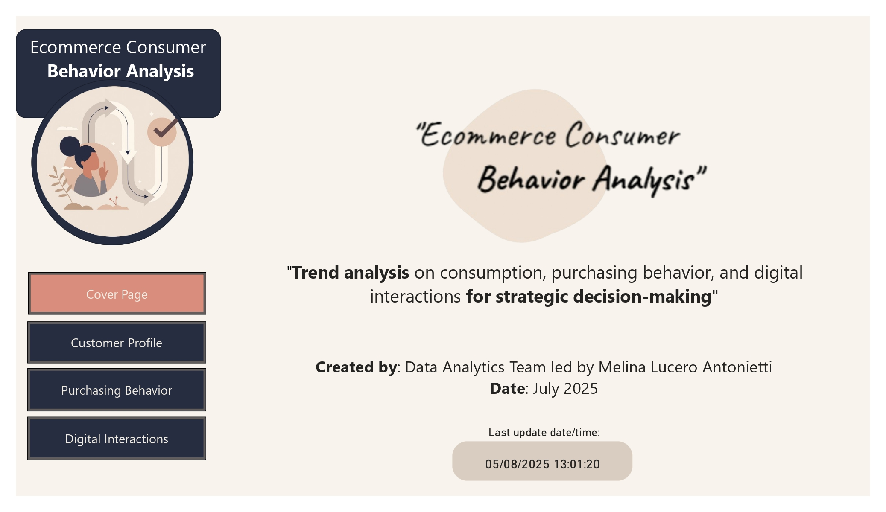
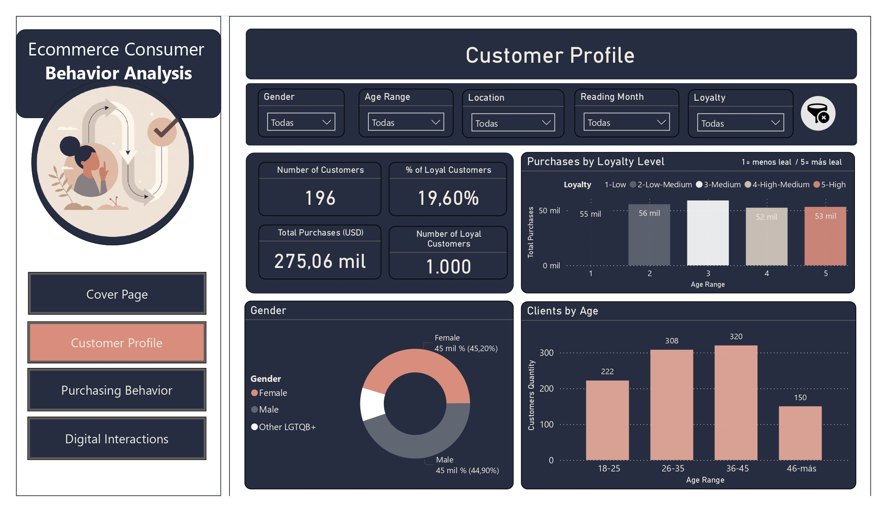
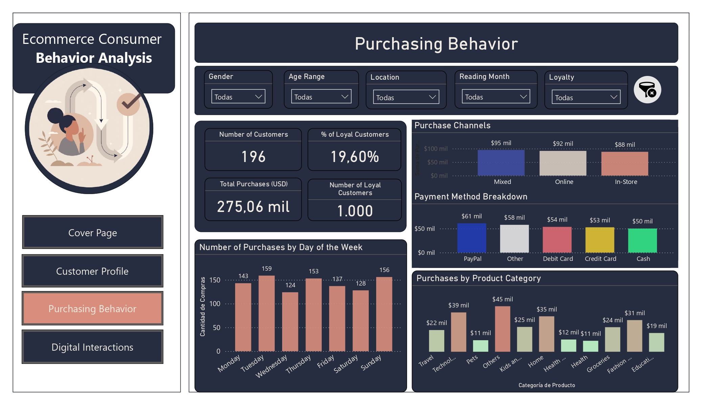
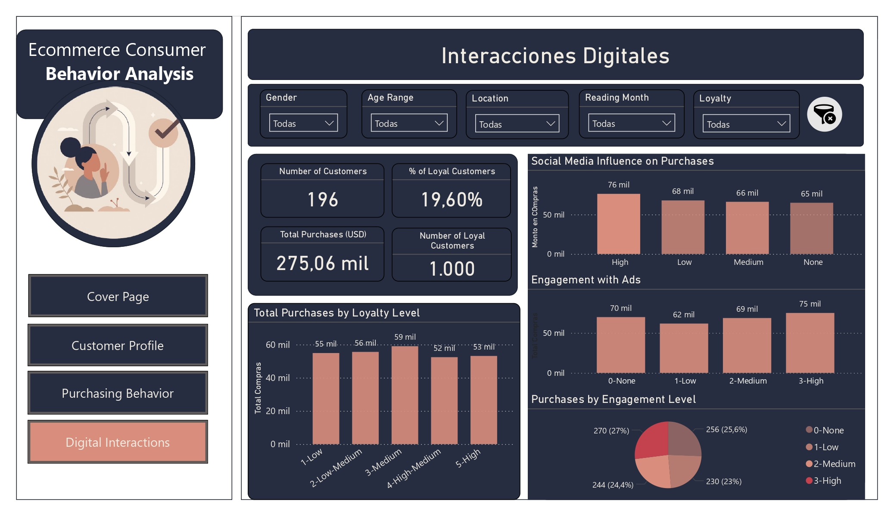

# 🛍️ Ecommerce Consumer Behavior Analysis (EN Version)

This repository contains the final project developed for the Data Analytics course at CoderHouse. It includes an exploratory analysis of consumer behavior in e-commerce environments using a normalized dataset and a Power BI dashboard for strategic insights.

---

## 📊 Project Overview

**Title:** Ecommerce Consumer Behavior Analysis  
**Author:** Melina Lucero Antonietti  
**Date:** July 2025  
**Tools:** Power BI, Excel, SQL, DAX  
**Dataset Source:** [Kaggle](https://www.kaggle.com) (public dataset platform)

---

## 🔍 Description

The goal of this project is to analyze purchasing behavior, customer loyalty, and digital engagement in e-commerce, by segmenting customers based on sociodemographic and behavioral patterns.

Key deliverables:
- Normalized dataset prepared for relational modeling
- Power BI dashboard with KPIs, interactive filters, and visual storytelling
- Documentation covering business context, hypotheses, data model, and conclusions

---

## 🧩 Files Included

| Type             | File |
|------------------|------|
| 📄 Final Report  | `documentation/Project_DOC_Ecommerce_Consumer_Behavior_Analysis_EN.pdf` |
| 📊 Dashboard     | `dashboard/Dashboard_PowerBI_Ecommerce_Consumer_Behavior.pbix` |
| 📁 Screenshots   | `dashboard/Dashboard_English_Screenshots/` |
| 📊 Dataset       | `data/Dataset_Ecommerce_Consumer_Behavior_Original.xlsx`  
| 🔧 Dataset       | `data/Dataset_Ecommerce_Consumer_Behavior_Normalized.xlsx`

---

### Dashboard Screenshots (EN)

**Cover Page**  

**Customer Profile**  

**Purchasing Behavior**  

**Digital Interactions**  

---

## 📌 Dashboard Pages

1. **Cover Page** – Introduction, objectives, navigation  
2. **Customer Profile** – Age, gender, location, loyalty  
3. **Purchasing Behavior** – Categories, channels, methods, days of the week  
4. **Digital Interactions** – Engagement, ad influence, loyalty segmentation  

---

## 📥 How to Use

To explore the project:

1. Download the dataset from the `data/` folder  
2. Open the `.pbix` file with Power BI Desktop  
3. Read the full documentation PDF for analysis context and conclusions  
4. View screenshots for visual reference or storytelling presentation  

---

## 📫 Contact

For questions or collaborations:  
📧 [melinaluceroant@gmail.com]
📎 [https://www.linkedin.com/in/melina-lucero/]

---

> © 2025 Melina Lucero Antonietti — This project was created as part of the final requirement for the CoderHouse Data Analytics course.
