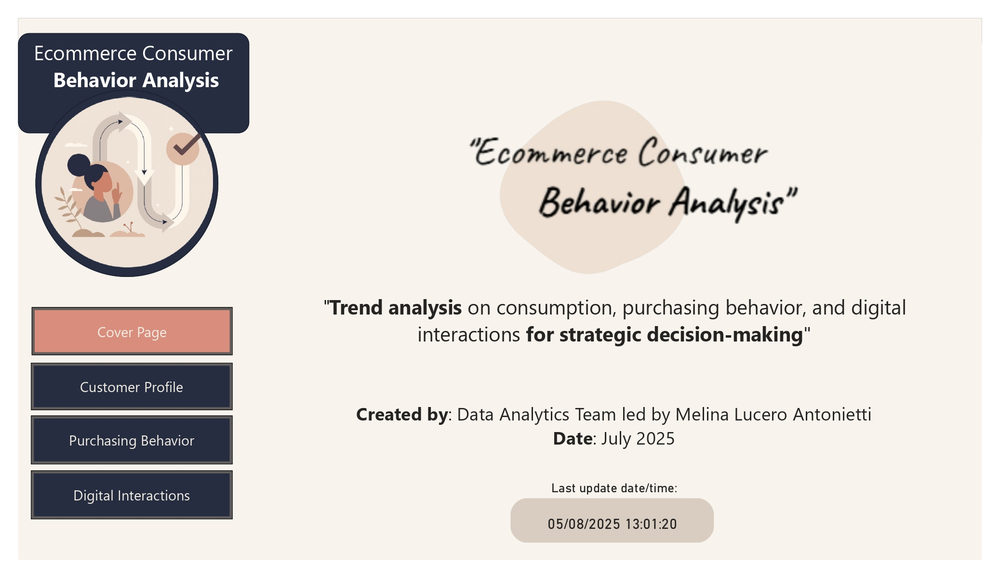
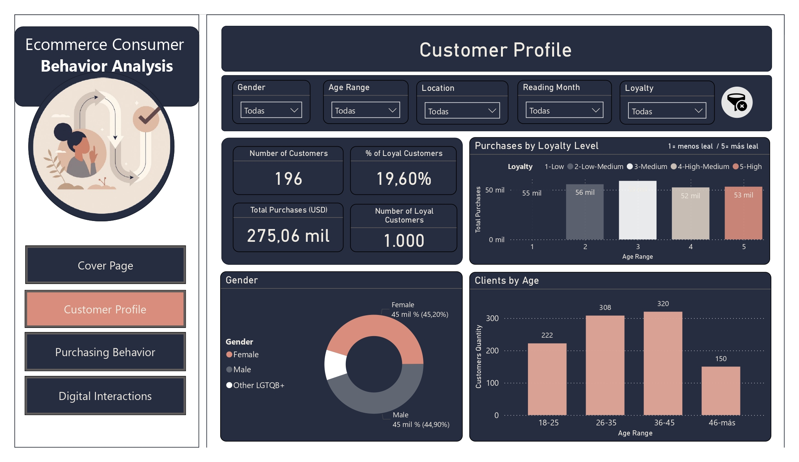
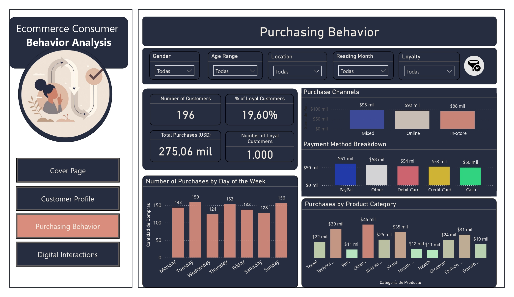
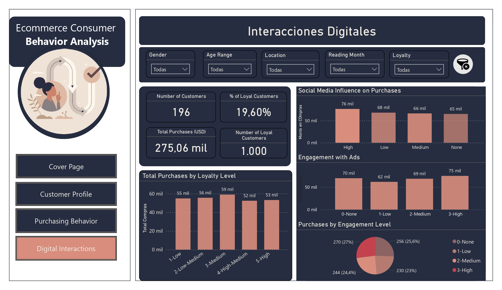

# 📦 Ecommerce Consumer Behavior Analysis

Final project for the Data Analytics course (CoderHouse), focused on analyzing consumer loyalty and digital interaction in e-commerce using Power BI.

---

## 📊 Project Summary

This project explores:
- Demographic segmentation of customers
- Patterns of purchase behavior across loyalty levels
- Weekday trends, channel and payment preferences
- Digital interaction: ads engagement, social media influence, research time

It was built with a fully normalized dataset in Excel, custom KPIs using DAX, and a dashboard structured for business storytelling.

---

## 🛠️ Tools Used

- **Power BI** (interactive dashboard, custom DAX measures, slicers, bookmarks)
- **Excel** (normalized relational dataset, dimension/fact model)
- **SQL & DAX** (aggregations, KPIs, time intelligence, logic)

---

## 📂 Files

| File Name | Description |
|----------|-------------|
| `Project DOC_Ecommerce Consumer Behavior Analysis.pdf` | Full project report & documentation |
| `Dashboard Power BI_Ecommerce Consumer Behavior Analysis.pbix` | Power BI dashboard (interactive) |
| `Dataset_Ecommerce Consumer Behavior Analysis.xlsx` | Cleaned and normalized dataset |
| `/assets/*.png` | Visuals of the dashboard pages |

---

### 🔧 Data Normalization

The original dataset contained redundant and denormalized structures, which could hinder performance and flexibility when building a relational data model. Therefore, a thorough normalization process was performed, resulting in a cleaner, more structured dataset.

Key steps taken in the normalization:

* **Splitting large tables**: The original dataset had multiple attributes grouped into a single table (e.g., client details, purchase records, product info). These were separated into distinct entities:

  * `Clients`: Contains unique customer identifiers and demographic information.
  * `Purchases`: Captures each transaction with purchase-specific details.
  * `Products` / `Purchase Categories`: Includes item categories, subcategories, and pricing.
  * `Interactions`: Captures engagement-related metrics (ads, satisfaction, research time).
* **Eliminating repetition**: Repeated values such as gender, category names, payment methods, and countries were abstracted into dimension tables.
* **Creating relationships**: Primary and foreign keys were defined (e.g., Customer\_ID, Product\_ID) to support referential integrity between tables.
* **Date handling**: A separate **calendar table** was created using Power Query to ensure proper handling of time-based analysis (by day, month, quarter, year, etc.), which is fundamental for dynamic filtering and historical KPIs.

This normalization enhances data integrity, improves performance within Power BI, and enables more accurate visual exploration and filtering through relationships defined in the data model.

---

### 🧹 Data Preparation & Transformation Highlights

Several preprocessing and modeling tasks were carried out to ensure better visualization and analytical capabilities in Power BI. Below are the main transformations and decisions applied:

#### ✅ Filters for dynamic reading

* **Gender**: The original dataset included 8 gender categories. For clarity and usability, we consolidated them into three key groups: *Female*, *Male*, and *Other/LGBTQ+*. This grouping improves readability while preserving inclusion.
* **Age**: Originally provided as a single integer value, age was transformed into **age ranges** for more practical filtering. Additionally, a **tooltip** was created to display detailed age information when hovering over the range chart.
* **Location**: Since the original field contained city-level data, we first derived **country** and then grouped by **continent** in the dashboard to facilitate macro-level analysis aligned with the project’s objective.
* **Loyalty Level**: We introduced a user-friendly loyalty segmentation from 1 to 5 and labeled each segment accordingly (*e.g., 1 - Low, 5 - High*) to allow easier reading and filtering.
* **Month Filter & Reset Shortcut**: A slicer by month was added for temporal insights, and a *"Clear Filters"* button allows the user to reset the view and begin a new reading path.

---

#### 📦 Product Categorization

* The original product category list was too granular, making the visuals cluttered. To address this:

  * A **macro-category** column was created grouping original categories into broader segments (*e.g., “Home”, “Fashion”, “Technology”*).
  * A **tooltip** was used to allow users to access the detailed (micro) categories by hovering over the macro view, preserving both detail and clarity.

#### 📊 Enhanced navigation & layout

* A **navigation menu** was placed at the top of each page, ensuring consistent access to every section of the report.
* Layouts maintain visual consistency across pages to simplify user interaction with filters and visuals.
* Each page was designed with clear KPIs and concise charts, optimized through **color gradients** (e.g., from pink to green in purchase volume) and distinct coloring by payment method or engagement type.

#### 🧠 Tooltip Implementation

* **Tooltip #1**: Linked to the Age Range chart, this view reveals individual age values within each range for more detailed understanding.
* **Tooltip #2**: Used in the Purchase by Category chart to show all micro-categories, resolving issues caused by overloading the main chart with too many categories.

---

### 🖼️ Dashboard Overview

Below you can find an overview of the dashboard visuals.  
For a full preview, access the complete PDF version:

📄 **[View Dashboard Preview (PDF)](https://drive.google.com/file/d/1XS3hGomkOAfIDBgiUbECpNmpuo5puQKS/view?usp=sharing)**  

#### 👤 Customer Profile Page
Focuses on understanding who the buyers are based on age, gender, location, and loyalty.

---

## 📸 Dashboard Previews

### 🧭 Cover Page

### 👥 Customer Profile

### 🛒 Purchase Patterns

### 📲 Digital Engagement

---

### 📊 Key Metrics

- 🎯 Total Purchases
- 🛒 Average Ticket Size
- 📅 Day with Most Purchases
- 💳 Top Payment Methods
- 📈 Engagement Level Score
- 🎯 Loyalty Level Distribution

---

## 📎 Portfolio Link

- [🔗 View PDF & Power BI on Google Drive](https://drive.google.com/file/d/1C_-P62q6jKNuokIZLGhFoteir2ee4XJS/view?usp=drive_link)

---

## 📌 Key Insights

- Most purchases come from mid-loyalty customers (level 3)
- Loyal customers are more consistent but spend slightly less overall
- Social media and ad engagement strongly influence purchase volume in mid-loyalty segments
- Most frequent buyers are aged 36–45 with balanced gender distribution

---

## 🔮 Future Work

- Predictive model for loyalty segmentation using machine learning
- Detailed analysis by product subcategories
- Campaign-level performance tracking and A/B testing
- Recommendations to improve customer retention and personalization

---

### ⚠️ Limitations

- The dataset contains simulated/aggregated data and may not reflect real-world behavior with full accuracy.
- The engagement metrics are self-reported, not tracked behaviorally.
- Some features had missing or ambiguous values, which required generalization (e.g., gender or location grouping).

⭐ *Thanks for visiting! Feel free to explore the dashboard and reach out for feedback or collaboration.*

---

## 📫 Contact

For questions or collaborations:  
📧 [melinaluceroant@gmail.com]
📎 [https://www.linkedin.com/in/melina-lucero/]

---

### 📚 References

- Dataset provided by XYZ Ecommerce (or Kaggle, etc.)
- Power BI Calendar table logic from official Microsoft Docs.
- Icons used from [Flaticon.com](https://www.flaticon.com)

